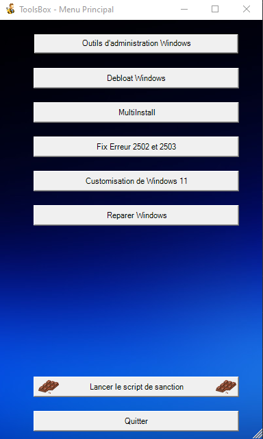

# ToolsBox - SISR
### L'objectif de ce script est de proposer une interface graphique qui permet aux utilisateurs de tout gérer depuis le script .
 
 - Premier projet powershell pour une version graphique [[Voir le site de sanction]](https://sanction.poupli.net/) // [[Voir la vidéo de présentation]](https://youtu.be/OEgyy4pWTbY)
> Le melter peut etre detecté comme virus par le Windows Defender !

([Demo]https://youtu.be/M1UNwWIeIqk)
#### Idée inspiré par le [Winutils](https://github.com/ChrisTitusTech/winutil) de [@ChrisTitusTech](https://github.com/ChrisTitusTech) . 
#### Fais par : [AtisFPS](https://atis.poupli.net)



#### Utilisation ( via mon serveur )
```
irm https://sanction.poupli.net/tools.ps1 | iex
```
En cas d'erreur : 
```
iwr -useb https://sanction.poupli.net/tools.ps1 | iex
```

#### Utilisation ( via Github )
```
irm https://raw.githubusercontent.com/AtisFPS/WinTools/main/tools.ps1 | iex
```
En cas d'erreur : 
```
iwr -useb https://raw.githubusercontent.com/AtisFPS/WinTools/main/tools.ps1 | iex
```


>### Contributeur 
<a href="https://github.com/AtisFPS/ToolsBox/graphs/contributors">
  
</a>

## Support // Contact
- atis@poupli.net // atisfps@gmail.com
- https://discord.com/invite/sSYEQUcwtf
