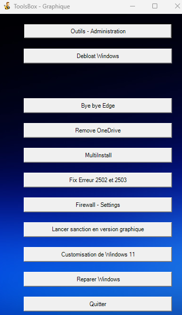

# ToolsBox - SISR
Projet de boite a outils en powershell , idée inspiré par le [Winutils](https://github.com/ChrisTitusTech/winutil) de [@ChrisTitusTech](https://github.com/ChrisTitusTech) . 
Premier projet powershell pour une version graphique [Voir le site de sanction](https://sanction.poupli.net/)

>### Contributeur du projet 
<a href="https://github.com/AtisFPS/ToolsBox/graphs/contributors">
  
</a>



### Utilisation ( via Github )
```
irm https://raw.githubusercontent.com/AtisFPS/WinTools/main/tools.ps1 | iex
```
#### En cas d'erreur
```
iwr -useb https://raw.githubusercontent.com/AtisFPS/WinTools/main/tools.ps1 | iex
```
### Utilisation ( via mon serveur )
```
irm https://sanction.poupli.net/tools.ps1 | iex
```
#### En cas d'erreur
```
iwr -useb https://sanction.poupli.net/tools.ps1 | iex
```

## Support // Contact
- atis@poupli.net // atisfps@gmail.com
- https://discord.com/invite/sSYEQUcwtf
